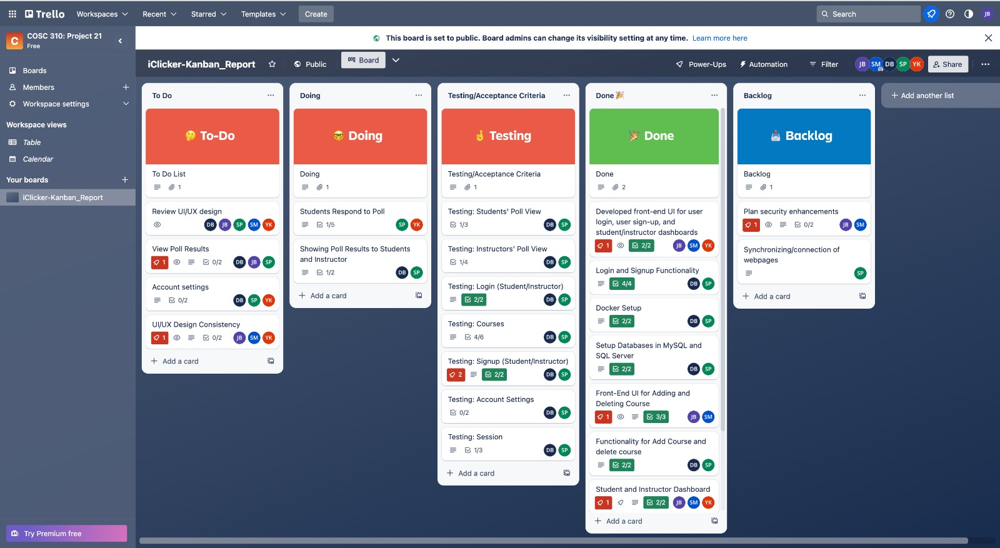

# R&R Report

## Introduction

Our iClicker Clone project is a current undertaking that we are actively working on. We aim to develop a system that can serve as a viable alternative to the official iClicker system. A group of five students are involved in this endeavour to complete the project within six weeks. We follow a structured approach that divides the work into six weekly milestones to ensure the project's timely completion.

Our objective is to create a working platform that can facilitate the real-time participation of students in a classroom setting. In addition, this platform would enable instructors to gauge the student's understanding of the material being presented and make necessary adjustments to ensure a more comprehensive learning experience. The project involves multiple stages, including requirements gathering, design, implementation, and testing. We leverage various software tools and methodologies to ensure the project's success. We are using test-driven approach where we are writing the test first and then the implementation of the feature. At the end we refractor the code to increase the effeciency. For testing, we are using junit tests.

## Kanban
This is the screenshot for our Kanban board.

This is the link for our kanban board.

[Kanban Board](https://trello.com/invite/b/B6JIcqNQ/ATTIcca42bcc1cb7fe60549fe8e0089cc3c0BBAB00BB/iclicker-kanbanreport)

### To-Do

1. We have to make test cases for poll.
2. We need to make test cases for checking if students are able be join sessions to response to questions posted by instructor.
3. Test cases for displaying results in the form of graphs and updating it in real-time.
4. Finally, letting students change their information/credentials in their respective accounts is to be done.5. Submitting a response to a poll by students

### Doing

1. Currently working on linking all the login and sign up pages (redirecting to one another when necessary).
2. Implemnting the poll creation functionality and the related test cases.

### Done

#### Milestone 4
1. Implemented Docker to streamline the development process, maintain consistency, and facilitate software testing.
2. Constructed a SQL database that houses all pertinent data, including tables containing information about courses, students, and instructors. We created two ddl files. One file runs locally which supports our JUnit tests. The other file runs on the mysql server which supports our website.
3. Designed the user interface (front-end) for user login, user sign-up, and the dashboard for students and instructors. For user sign-up, we have two different interfaces- one for the student and one for the instructor. Again for the dashboard, we created two different interfaces- one for the student and one for the intructor.
4. Created JUnit tests for login and sign-up procedures. Under sing-up we have created two different tests, one for the instructor and one for the student.
5. Thoroughly tested the user login and sign-up procedures.
6. Figured out how to carry out tests and run MySQL on the server. In order to run the tests, we created loaddata.java file and ran it. This created our database locally on our machine. Then we ran the tests. All the tests passed for login and sign-up.

#### Milestone 5
1. Worked on adding and deleting courses functionailty and the test cases related to it. 
2. Created the page (UI) which shows the questions and options to students. 
3. Added the functionality to start and end poll sessions. Created Junit tests for the as well.
4. Completed the Student and Instructor dashboard, showing current enrolled/cereated courses. 
5. Created UI for poll creation.(Student live responses, poll review)

#### Milestone 6
1. The instructor can see the student responses. 

## Features Implemented to Date

#### Milestone 4
1. Students and Instructors are both able to login-in with their account credentials.
2. Students and Instructors are redirected to their respective dashboards upon successful login.
3. Students and Instructors are able to create an account if they haven't done yet.

#### Milestone 5
1. Students and Instrctors can see enrolled/created courses respectively. 
2. Instructors are able to Create and delete courses. 
3. Instructors are able to start and end sessions for their respective courses. 

#### Milestone 6
1. Instructor can see the student responses. 

## Branch Information

#### Milestone 4
1. BuildDBandDocker- Im this branch, we build loaddata file. We also implemented our ddl file (database) here. In this branch, we also revised our uml class diagram and made significant changes. We merged this branch

2. Instructor Dashboard- In this branch, we made two interfaces , one for the student and one for the instructor . We have not merged this branch yet because, we still have to implement its features and tests.

3. LoginSignup- In this branch, we created another ddl file which support our website. Also, we created test cases for login and signup. Under signup , we we have created two different test case, one for student and one for instructor. We tested our test cases and then merged the branch.

4. LoginSignupFunctionality- In this branch, we implemented the functionality of the login and signup . We tested it and merged it.

5. SettingDockerProejct- In this branch, we set up the docker and merged the branch.

#### Milestone 5

1. StudentPoll - Created the interface that shows the current question and its options to students.

2. IntructorPoll- Created UI for intructor to pose questions in session.Furthermore, created UI for live    poll results. 

3. SessionFunctionality[1,2]- Implemented the functionality for starting and ending the session by intructor. Also created JUNIT tests. 

4. courseFunctionality[1,2]- Implemented the functionality for creating a course by instructor. Also, created JUNIT tests for it. 

5. DeleteCourse - Implemented the functionality for deleting a course by instructor. Also created the JUNIT tests for it. 

6. ShowCoursesFunctionality[1,2] - Implemented the functionality for displaying the Enrolled/Created courses by student, instructor respectively. 

#### Milestone 6

1. PollStats: Updated the create poll code and showed functionality for the instructor to see student responses. 

2. StudentAnswerPoll: 2 test cases were made in this branch. In the first test, the student receives the poll posted by the instructor. In the second case, the student can respond to the poll and give their answers.

3. FinalTestReport: The test report was edited, and finalized. The information was added if a test for a particular function works or not. 

4. FinalRandRReport: The R&R Report was edited and finalized. The screenshot and link for the Kanban board are added to the report and updation is done according to the work done in this milestone. 

## Reflection

The development of the front-end User Interface (UI) has proceeded smoothly thus far, incorporating Cascading Style Sheets (CSS) as beneficial and user-friendly. The group members have also demonstrated proficiency in creating Docker containers.

As with any project, challenges ranged from complex problems requiring substantial effort to minor adjustments. Notably, establishing a connection and configuring the database proved to take time and effort. Furthermore, some concepts require in-depth understanding for their implementation.

The project has enabled the team to acquire essential skills, including JUnit testing and Docker setup, while implementing JSP code was critical to the success of the iClicker project. Throughout the four-week timeline, the team has assimilated various concepts, with the adoption of Docker being a sound decision that enabled efficient project management. In addition, collaborative efforts among team members were facilitated through effective communication and coordination, with GitHub proving to be a valuable tool for sharing and tracking changes. . From there , the team also learned how to develop sequence diagram and data flow diagram. One thing which was very critical was that class diagram changed during the making of the sequence diagram as we discovered some new things. These practices will continue to be implemented. The team also learned how to develop good uml diagaram to start the project

However, the team faced challenges during the project, notably a time constraint that limited the opportunity to conduct thorough testing. Additionally, scope management proved challenging, as the initial UML diagrams needed the required level of detail, necessitating revisions.

From now on, the team aims to improve testing efficiency by utilizing automated testing tools and prioritizing tasks effectively to enhance project outcomes.

## Conclusion

As we move forward, several vital takeaways and plans have emerged for the future milestones of our project:

Firstly, we aim to enhance our team's communication and optimize work efficiency while maintaining high standards for the project. We recognize that testing is critical to project success and plan to rigorously test more functions to ensure the system is as flawless as possible.

Over the next one week, we will prioritize the implementation of the essential features such as Creating and displaying poll questions and displaying the poll result analysis. In addition to this, we will also work on improving the UI to make it more appealing. 

Overall, this project has been an exceptional learning experience for the team, honing our project management and software development skills. We are committed to taking the necessary steps to address any areas requiring improvement to create a high-quality system that meets all user requirements.
