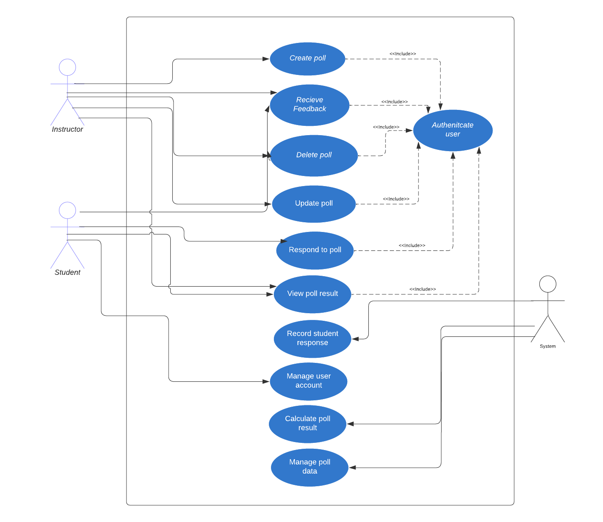

## Final Video for the Project

[Video link](https://youtu.be/xxgTXwRAvXU)

# The Project

The project provides you an opportunity to build upon the foundational knowledge acquired in this course. It is designed to help you develop an advanced understanding of software engineering principles, tools, and techniques using structured requirements gathering and analysis, software development process, design patterns, software architecture, and software testing.  You will also need to consider your development methodology (don’t use waterfall), software metrics, and software quality assurance.

As a team, you will select a project, develop a set of requirements, conduct a formal analysis of the project, develop an architecture, and then using TDD and an Agile workflow, iterate and develop your projects.  During your project, you MUST consider design patterns and anti-patterns, TDD, dockerization, and CI/CD.  The goal is not necessarily to build a complex system, but to practice and become comfortable with the techniques, be able to analyze and decompose a problem, and incrementally develop and deploy a solution using a branching workflow.

Internally, within your team, you are free to manage efforts and tasks with the understanding that everyone is expected to contribute equally in some fashion.  During the project, you will have the chance to confidentially conduct peer reviews using the credit-earned model (see document on Canvas regarding this) at a number of key points.   Your individual project grade will be impacted using the results of the peer evaluation.   The key point is that if you don’t contribute to the project, your mark will reflect this.  This will be discussed in class.

You must have:

* Unit tests and integration tests to ensure code quality and functionality
* A deployment pipeline using CI/CD to automatically test and deploy changes to the codebase
* Identified what design patterns you are using and describe why
* Dockerized deployment
* Continual and ongoing work using TDD 
* A team between 3-5 people (no more, no less) - target for 4

## Project Goals:

* To deepen the students' understanding of software engineering principles, tools, and techniques.
* To enable students to apply software engineering principles, tools, and techniques to the development of complex software systems.
* To introduce students to agile development methodologies, software metrics, and software quality assurance.
* To foster collaboration and teamwork among students in the development of software systems.

## Project Objectives:

By the end of this project, students will be able to:

* Apply the software development process model, to the development of a software system
* Design software systems using appropriate design patterns and principles
* Develop software architectures for complex software systems
* Use software testing techniques to ensure the quality of software systems
* Apply agile development methodologies to the development of software systems
* Apply software metrics to evaluate the quality of software systems
* Develop software quality assurance plans to ensure the quality of software systems
* Apply and develop a CI/CD pipeline for automated testing and deployment
* Utilize dockerization to containerize your application
* Work collaboratively in teams to develop software systems
* Peer Evaluation: see Peer Evaluation

**Milestone #2** – Project Description and Requirements (March 13th).  A summary of “What” your project is, who the users are, and “What” your project will do (functional, non-functional requirements, etc) including use cases (properly dressed with the appropriate level of abstraction.   Consider the tools (proto-personal, journey lines)(13%)

## The Project:

**iClicker Clone:** This project involves the development of a web-based platform for classroom polling and feedback. The platform should allow instructors to pose questions to students and receive instant feedback. The platform should incorporate the Observer design pattern to notify the instructor of student responses, and the Facade design pattern to simplify the interface between the user and the underlying system.  Additionally, the system should incorporate Continuous Integration and Deployment (CI/CD) and automated testing and deploy quickly and without errors. 

<H1 align='center'> Project: iClicker Clone</h1>

### Description:
 We, as a group, have decided to create a working iClicker clone. The iClicker clone project aims to develop a mobile application that will serve as an alternative to the physical iClicker system. With the help of the app, students can respond to the questions posed by the teacher and get immediate feedback in real time on how well they understand the material. It is accessible from any mobile device and includes a user-friendly design that enables students to choose their answers to a variety of prompts and multiple-choice questions. To design an iClicker app, the  project team will try to include crucial elements such as real-time feedback to both students and teachers which will not take more than 5 seconds (Response time will be less than 5 seconds), and an average user rating of atleast 4 out of 5 for ease of use, as determined by a post-launch survey of app users. The app will also provide feedback in the form of graphs and maintain a proper count or score for the particular user in their account. The app can also be integrated with the teacher's computer or digital presentation platform so they can observe student replies in real-time and know which concept needs to be explained more. The iClicker clone project has the potential to improve student involvement in the classroom by giving insightful information about how well they comprehend the subject matter and prompting feedback to encourage active participation.

 

 ### Requirements Analysis and Development: 

There are three main types of requirments listed below.

1. The user requirements are
- Intructor should be able to start the session. 
- Instructors should be able to post multpile- choice questions to student using the platform
- Student would be able to join the class as one big session.
- The app will be regularly updated and improvements should be made according to the feedback provided by the instructor. 
- Students should be able to respond to questions and sumit their answer throught the platform.
- The instructor and student should be able to see what the student has answered. 
- The instructor should be able to start the poll and end the poll acording to his convenience .
- The students should be able to change their answer if the poll is still open. 
- The instructor should be able to post the right answer and student should be able to see what the right answer is 

2. The functional requirement is:
- The platform must allow the students and the instructors to create and delete account.
- The platform must allow the users to update account information such as name, email id
- The platform must allow the instructor to create and delete a course.
- The platform must allow the student to join and leave a course.
- The platform must allow instructors to create poll that is displayed to students.
- The platform must allow students to select and submit their reponse to polls.
- The platform must show the results of the poll to the instructor in real-time.
- The platform must store data of students, instructors, and poll in a database, which can be retrived by the application.
- The platform must allow the instructor to create a session (for each lecture/speech) in which multiple polls can be created, and at the end, the session can be terminated.
-  The platform will be able to show the responses in the form of graphs or any other visualization for better understanding to the instructor. Also, the visualizations and responses will be updated as new responses come in in real time. These visualizations will be showed to the students when the poll is over. 

3. The non-functional requirements are:
- The application will be based on continuous integration (CI) and continious development(CD). The changes could be made on the appplication according to the feedback with ease.
- The poll should be shown to the students in less than 5 seconds upon creation of a poll by the instructor.
- If a poll is updated or deleted by an instructor, the changes must updated in the database and visible to the students in less than 5 seconds. 
- If a student changes their answer, it should should be updated in the database within 2 seconds. 
- The application will be compatible with various kinds of operating systems, and devices with older software versions as well. 
- The application could also be used by various people with special needs. The accessibility will be increased by adding features like font adjustment, voice reading of the text, and more.
- Any updates to the student or instructor account must be synched within the database in less than 30 seconds. 

## Use case Diagram- 

